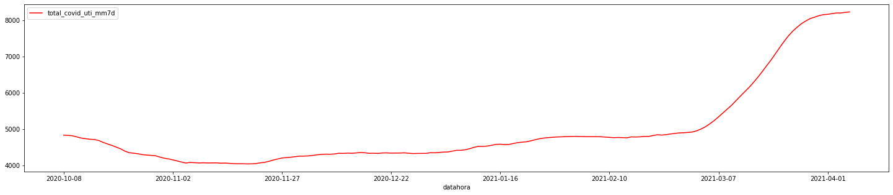

# Covid-19 Lab

Quanto os leitos destinados para Covid-19 representam do total de leitos de grande SP? Como está essa evolução?

- Fontes de dados
    - https://github.com/seade-R/dados-covid-sp
    - https://www.seade.gov.br/coronavirus/
    - https://www.redesocialdecidades.org.br/br/SP/sao-paulo/leitos-hospitalares
    - http://www.scielo.br/scielo.php?script=sci_arttext&pid=S0103-73312020000300316


- Links importantes
    - https://www.saopaulo.sp.gov.br/planosp/simi/leitos/
    - https://www.cnnbrasil.com.br/saude/2021/03/19/dados-mostram-que-covid-19-ja-e-a-doenca-que-mais-matou-no-brasil-em-2021
    - https://www.cnnbrasil.com.br/saude/2021/03/18/sp-supera-90-de-ocupacao-em-leitos-de-uti-16-estados-e-o-df-estao-em-colapso


```python
import pandas as pd
import matplotlib.pyplot as plt

DATA_PATH = 'data/'
```


```python
file_name = 'plano_sp_leitos_internacoes_serie_nova_variacao_semanal_2.csv'
leitos_internacoes = 'Leitos-e-Internacoes.csv'
```

## Dados sobre os casos de internações no estado de SP


```python
df = pd.read_csv(DATA_PATH + file_name, sep=';', decimal=',')
```


```python
df.head()
```


<div>
<style scoped>
    .dataframe tbody tr th:only-of-type {
        vertical-align: middle;
    }

    .dataframe tbody tr th {
        vertical-align: top;
    }

    .dataframe thead th {
        text-align: right;
    }
</style>
<table border="1" class="dataframe">
  <thead>
    <tr style="text-align: right;">
      <th></th>
      <th>datahora</th>
      <th>nome_drs</th>
      <th>pacientes_uti_mm7d</th>
      <th>total_covid_uti_mm7d</th>
      <th>ocupacao_leitos</th>
      <th>pop</th>
      <th>leitos_pc</th>
      <th>internacoes_7d</th>
      <th>internacoes_7d_l</th>
      <th>internacoes_7v7</th>
      <th>pacientes_uti_ultimo_dia</th>
      <th>total_covid_uti_ultimo_dia</th>
      <th>ocupacao_leitos_ultimo_dia</th>
      <th>internacoes_ultimo_dia</th>
      <th>pacientes_enf_mm7d</th>
      <th>total_covid_enf_mm7d</th>
      <th>pacientes_enf_ultimo_dia</th>
      <th>total_covid_enf_ultimo_dia</th>
    </tr>
  </thead>
  <tbody>
    <tr>
      <th>0</th>
      <td>2020-10-08</td>
      <td>DRS 01 Grande São Paulo</td>
      <td>2036.86</td>
      <td>4829.86</td>
      <td>42.17</td>
      <td>21138247</td>
      <td>22.85</td>
      <td>4121</td>
      <td>4093</td>
      <td>0.68</td>
      <td>2011</td>
      <td>4798</td>
      <td>41.91</td>
      <td>658</td>
      <td>2533.86</td>
      <td>7104.86</td>
      <td>2555</td>
      <td>7010</td>
    </tr>
    <tr>
      <th>1</th>
      <td>2020-10-08</td>
      <td>DRS 02 Araçatuba</td>
      <td>58.71</td>
      <td>118.57</td>
      <td>49.52</td>
      <td>764041</td>
      <td>15.52</td>
      <td>126</td>
      <td>131</td>
      <td>-3.82</td>
      <td>59</td>
      <td>120</td>
      <td>49.17</td>
      <td>22</td>
      <td>94.71</td>
      <td>302.43</td>
      <td>99</td>
      <td>302</td>
    </tr>
    <tr>
      <th>2</th>
      <td>2020-10-08</td>
      <td>DRS 03 Araraquara</td>
      <td>45.14</td>
      <td>123.29</td>
      <td>36.61</td>
      <td>991435</td>
      <td>12.44</td>
      <td>248</td>
      <td>222</td>
      <td>11.71</td>
      <td>49</td>
      <td>123</td>
      <td>39.84</td>
      <td>39</td>
      <td>125.86</td>
      <td>388.86</td>
      <td>141</td>
      <td>408</td>
    </tr>
    <tr>
      <th>3</th>
      <td>2020-10-08</td>
      <td>DRS 04 Baixada Santista</td>
      <td>108.14</td>
      <td>409.14</td>
      <td>26.43</td>
      <td>1831884</td>
      <td>22.33</td>
      <td>205</td>
      <td>189</td>
      <td>8.47</td>
      <td>110</td>
      <td>412</td>
      <td>26.70</td>
      <td>31</td>
      <td>165.00</td>
      <td>690.29</td>
      <td>180</td>
      <td>691</td>
    </tr>
    <tr>
      <th>4</th>
      <td>2020-10-08</td>
      <td>DRS 05 Barretos</td>
      <td>55.57</td>
      <td>91.86</td>
      <td>60.49</td>
      <td>425090</td>
      <td>21.61</td>
      <td>192</td>
      <td>150</td>
      <td>28.00</td>
      <td>58</td>
      <td>91</td>
      <td>63.74</td>
      <td>27</td>
      <td>54.43</td>
      <td>243.14</td>
      <td>49</td>
      <td>248</td>
    </tr>
  </tbody>
</table>
</div>


```python
df.columns
```


    Index(['datahora', 'nome_drs', 'pacientes_uti_mm7d', 'total_covid_uti_mm7d',
           'ocupacao_leitos', 'pop', 'leitos_pc', 'internacoes_7d',
           'internacoes_7d_l', 'internacoes_7v7', 'pacientes_uti_ultimo_dia',
           'total_covid_uti_ultimo_dia', 'ocupacao_leitos_ultimo_dia',
           'internacoes_ultimo_dia', 'pacientes_enf_mm7d', 'total_covid_enf_mm7d',
           'pacientes_enf_ultimo_dia', 'total_covid_enf_ultimo_dia'],
          dtype='object')


## Gráficos mostrando ocupação de leitos destinados a Covid-19 e internações totais


```python
plt.rcParams['figure.figsize'] = [25, 5]

grande_saopaulo = df.loc[df['nome_drs'] == 'DRS 01 Grande São Paulo']

# gca stands for 'get current axis'
#ax = plt.gca()

grande_saopaulo.plot(kind='line',x='datahora',y='ocupacao_leitos')
grande_saopaulo.plot(kind='line',x='datahora',y='total_covid_uti_mm7d', color='red')
grande_saopaulo.plot(kind='line',x='datahora',y='total_covid_enf_ultimo_dia', color='purple')
#df.plot(kind='line',x='name',y='num_pets', color='red', ax=ax)

plt.show()
```


    

    


    

    


    

    


## Dados de leitos totais no estado


```python
variaveis_sp = 'pt-brvariaveis.rede-brasileira_br_sp_sao-paulo_leitos-hospitalares.csv'
df_variaveis = pd.read_csv(DATA_PATH + variaveis_sp, sep=',', decimal=',')
```


```python
df_variaveis.tail()
```


<div>
<style scoped>
    .dataframe tbody tr th:only-of-type {
        vertical-align: middle;
    }

    .dataframe tbody tr th {
        vertical-align: top;
    }

    .dataframe thead th {
        text-align: right;
    }
</style>
<table border="1" class="dataframe">
  <thead>
    <tr style="text-align: right;">
      <th></th>
      <th>ID da cidade</th>
      <th>Nome da cidade</th>
      <th>ID</th>
      <th>Tipo</th>
      <th>Apelido</th>
      <th>Período de atualização</th>
      <th>É Básica?</th>
      <th>Unidade de medida</th>
      <th>Nome</th>
      <th>Data</th>
      <th>Valor</th>
      <th>Observações</th>
      <th>Fonte preenchida</th>
      <th>Nome Região</th>
      <th>Valor ativo?</th>
      <th>Gerado por computador?</th>
      <th>ID da Região</th>
      <th>Nível da Região</th>
    </tr>
  </thead>
  <tbody>
    <tr>
      <th>26</th>
      <td>1</td>
      <td>São Paulo</td>
      <td>58</td>
      <td>Inteiro</td>
      <td>numero_total_de_leitos_hospitalares</td>
      <td>anual</td>
      <td>não</td>
      <td>NaN</td>
      <td>Número total de leitos hospitalares</td>
      <td>01/01/2014</td>
      <td>34269</td>
      <td>NaN</td>
      <td>SMS (Secretaria Municipal da Saúde)/SES (Secre...</td>
      <td>NaN</td>
      <td>não</td>
      <td>não</td>
      <td>NaN</td>
      <td>NaN</td>
    </tr>
    <tr>
      <th>27</th>
      <td>1</td>
      <td>São Paulo</td>
      <td>58</td>
      <td>Inteiro</td>
      <td>numero_total_de_leitos_hospitalares</td>
      <td>anual</td>
      <td>não</td>
      <td>NaN</td>
      <td>Número total de leitos hospitalares</td>
      <td>01/01/2015</td>
      <td>34639</td>
      <td>NaN</td>
      <td>CNES (Cadastro Nacional dos Estabelecimentos d...</td>
      <td>NaN</td>
      <td>não</td>
      <td>não</td>
      <td>NaN</td>
      <td>NaN</td>
    </tr>
    <tr>
      <th>28</th>
      <td>1</td>
      <td>São Paulo</td>
      <td>58</td>
      <td>Inteiro</td>
      <td>numero_total_de_leitos_hospitalares</td>
      <td>anual</td>
      <td>não</td>
      <td>NaN</td>
      <td>Número total de leitos hospitalares</td>
      <td>01/01/2016</td>
      <td>33526</td>
      <td>Elaboração: SMUL/Deinfo</td>
      <td>CNES (Cadastro Nacional dos Estabelecimentos d...</td>
      <td>NaN</td>
      <td>não</td>
      <td>não</td>
      <td>NaN</td>
      <td>NaN</td>
    </tr>
    <tr>
      <th>29</th>
      <td>1</td>
      <td>São Paulo</td>
      <td>58</td>
      <td>Inteiro</td>
      <td>numero_total_de_leitos_hospitalares</td>
      <td>anual</td>
      <td>não</td>
      <td>NaN</td>
      <td>Número total de leitos hospitalares</td>
      <td>01/01/2017</td>
      <td>34458</td>
      <td>NaN</td>
      <td>SMS (Secretaria Municipal da Saúde)/SES (Secre...</td>
      <td>NaN</td>
      <td>não</td>
      <td>não</td>
      <td>NaN</td>
      <td>NaN</td>
    </tr>
    <tr>
      <th>30</th>
      <td>1</td>
      <td>São Paulo</td>
      <td>58</td>
      <td>Inteiro</td>
      <td>numero_total_de_leitos_hospitalares</td>
      <td>anual</td>
      <td>não</td>
      <td>NaN</td>
      <td>Número total de leitos hospitalares</td>
      <td>01/01/2018</td>
      <td>29018</td>
      <td>Elaboração: Rede Nossa São Paulo</td>
      <td>SMS (Secretaria Municipal da Saúde)/SES (Secre...</td>
      <td>NaN</td>
      <td>não</td>
      <td>não</td>
      <td>NaN</td>
      <td>NaN</td>
    </tr>
  </tbody>
</table>
</div>


```python
df_variaveis['Nome da cidade'].unique()
```


    array(['São Paulo'], dtype=object)


```python
df_variaveis.columns
```


    Index(['ID da cidade', 'Nome da cidade', 'ID', 'Tipo', 'Apelido',
           'Período de atualização', 'É Básica?', 'Unidade de medida', 'Nome',
           'Data', 'Valor', 'Observações', 'Fonte preenchida', 'Nome Região',
           'Valor ativo?', 'Gerado por computador?', 'ID da Região',
           'Nível da Região'],
          dtype='object')


```python
df_leitos = df_variaveis.loc[df_variaveis['Apelido'] == 'numero_total_de_leitos_hospitalares']
```

## Estimando o número de leitos na grande São Paulo

Estimativa simples da quantidade de leitos totais disponíveis na grande São Paulo. Aqui não temos a variação por criação de novos leitos por iniciativas governamentais e/ou privadas.


```python
total_leitos_abril_2020 = 31292 # COTRIM JUNIOR, Dorival Fagundes  and  CABRAL, Lucas Manoel da Silva. Crescimento dos leitos de UTI no país durante a pandemia de Covid-19: desigualdades entre o público x privado e iniquidades regionais. Physis [online]. 2020, vol.30, n.3 [cited  2021-04-05], e300317. Available from: <http://www.scielo.br/scielo.php?script=sci_arttext&pid=S0103-73312020000300316&lng=en&nrm=iso>.  Epub Sep 18, 2020. ISSN 1809-4481.  https://doi.org/10.1590/s0103-73312020300317.
pop = 88371433
leitos_por_mil_hab = total_leitos_abril_2020 / pop * 1000

pop_grande_sp = 44000000
max_leitos = pop_grande_sp / 1000 * leitos_por_mil_hab

print(max_leitos)
```

    15580.23846914421
    


```python
df_leitos.plot(kind='line',x='Data',y='Valor')

plt.show()
```


    

    


## Leitos Covid-19 vs leitos totais em SP

Considerando a variável "numero_total_de_leitos_hospitalares", temos como fazer uma verificação simples de quantidade de leitos atribuídos para covid-19 vs o número total.


```python
grande_saopaulo = df.loc[df['nome_drs'] == 'DRS 01 Grande São Paulo'].copy()
grande_saopaulo['leitos_covid_19'] = grande_saopaulo['total_covid_uti_mm7d'] + 0 #grande_saopaulo['total_covid_enf_ultimo_dia']

leitos_covid = grande_saopaulo[['datahora', 'leitos_covid_19', 'ocupacao_leitos']].copy()
leitos_covid['max_leitos_geral'] = max_leitos # constante para todas as rows
leitos_covid['oferta_covid19_leitos_geral'] = leitos_covid['leitos_covid_19'] / leitos_covid['max_leitos_geral'] * 100
leitos_covid['leitos_total_ocupados'] = (leitos_covid['ocupacao_leitos'] / 100) * leitos_covid['leitos_covid_19']
leitos_covid['ocupacao_relativa'] = leitos_covid['ocupacao_leitos'] / 100 * leitos_covid['oferta_covid19_leitos_geral']
```


```python
leitos_covid.tail()
```


<div>
<style scoped>
    .dataframe tbody tr th:only-of-type {
        vertical-align: middle;
    }

    .dataframe tbody tr th {
        vertical-align: top;
    }

    .dataframe thead th {
        text-align: right;
    }
</style>
<table border="1" class="dataframe">
  <thead>
    <tr style="text-align: right;">
      <th></th>
      <th>datahora</th>
      <th>leitos_covid_19</th>
      <th>ocupacao_leitos</th>
      <th>max_leitos_geral</th>
      <th>oferta_covid19_leitos_geral</th>
      <th>leitos_total_ocupados</th>
      <th>ocupacao_relativa</th>
    </tr>
  </thead>
  <tbody>
    <tr>
      <th>3168</th>
      <td>2021-04-02</td>
      <td>8178.71</td>
      <td>92.05</td>
      <td>15580.238469</td>
      <td>52.494126</td>
      <td>7528.502555</td>
      <td>48.320843</td>
    </tr>
    <tr>
      <th>3186</th>
      <td>2021-04-03</td>
      <td>8197.14</td>
      <td>91.82</td>
      <td>15580.238469</td>
      <td>52.612417</td>
      <td>7526.613948</td>
      <td>48.308721</td>
    </tr>
    <tr>
      <th>3204</th>
      <td>2021-04-04</td>
      <td>8197.29</td>
      <td>91.80</td>
      <td>15580.238469</td>
      <td>52.613380</td>
      <td>7525.112220</td>
      <td>48.299082</td>
    </tr>
    <tr>
      <th>3222</th>
      <td>2021-04-05</td>
      <td>8213.43</td>
      <td>91.51</td>
      <td>15580.238469</td>
      <td>52.716972</td>
      <td>7516.109793</td>
      <td>48.241301</td>
    </tr>
    <tr>
      <th>3240</th>
      <td>2021-04-06</td>
      <td>8226.57</td>
      <td>91.10</td>
      <td>15580.238469</td>
      <td>52.801310</td>
      <td>7494.405270</td>
      <td>48.101993</td>
    </tr>
  </tbody>
</table>
</div>


## Oferta de leitos para Covid-19 vs Ocupação

Abaixo temos a porcentagem referente aos leitos totais da grande São Paulo destinados a Covid-19 e sua ocupação no tempo


```python
plt.rcParams['figure.figsize'] = [35, 5]
ax = plt.gca()

leitos_covid.plot(kind='line',x='datahora',y='ocupacao_relativa', color='red', ax = ax)
leitos_covid.plot(kind='bar',x='datahora',y='oferta_covid19_leitos_geral', ax = ax, alpha=0.5)

plt.xticks(rotation=90)
plt.show()
```


    

    


```python

```
